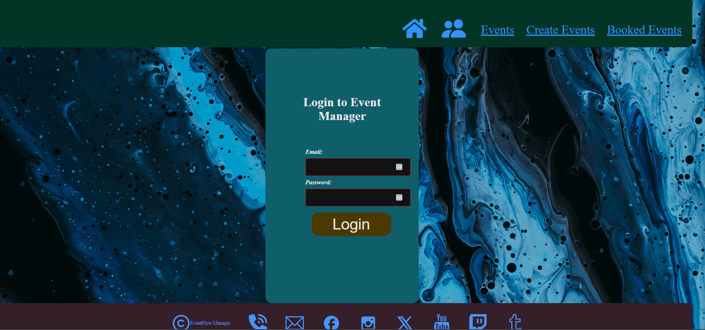
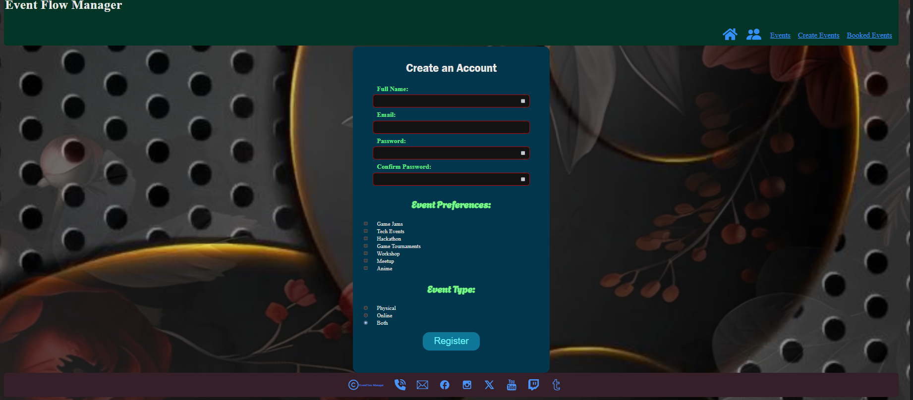
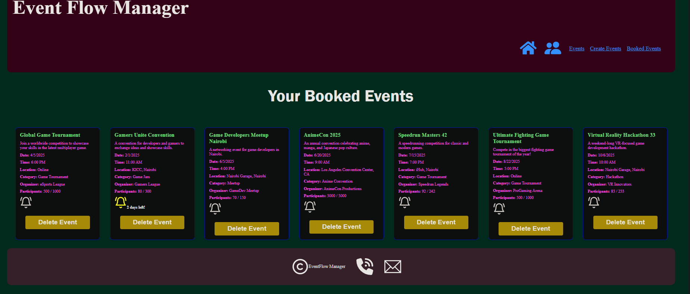

# 💎 EventFlow Manager 💎
EventFlow is a simple, easy-to-use app that helps you manage 
all your events in one place.
It allows you to create, edit, delete, and view event details effortlessly. 
You can search and filter events by their themes or dates, and a 
notification bell will remind you when an event is coming up.

### 💠 Features 💠
📌 Display event cards with name, date, and duration. ✅

📌 View event details on a separate page by clicking on a card. ✅

📌 User login system for personalized access. ✅

📌 Book an event. ✅

📌 Add new events using a simple form. ✅

📌 Edit or update existing events. ✅

📌 Delete events when no longer needed. ✅

📌 Search events. ✅

📌 Notification bell for reminders about upcoming events.✅

### ✪ Final Products Preview ✪

